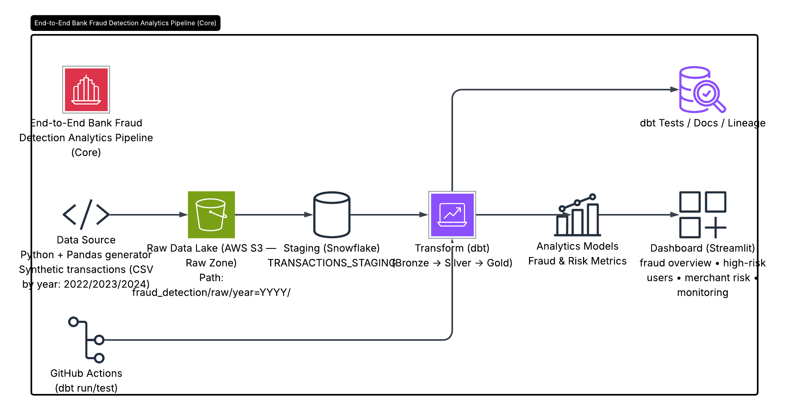
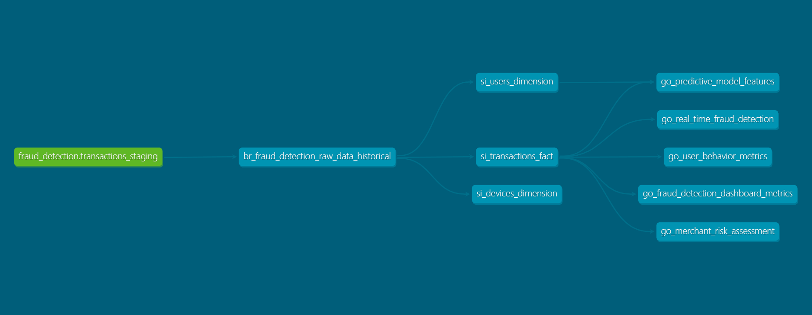
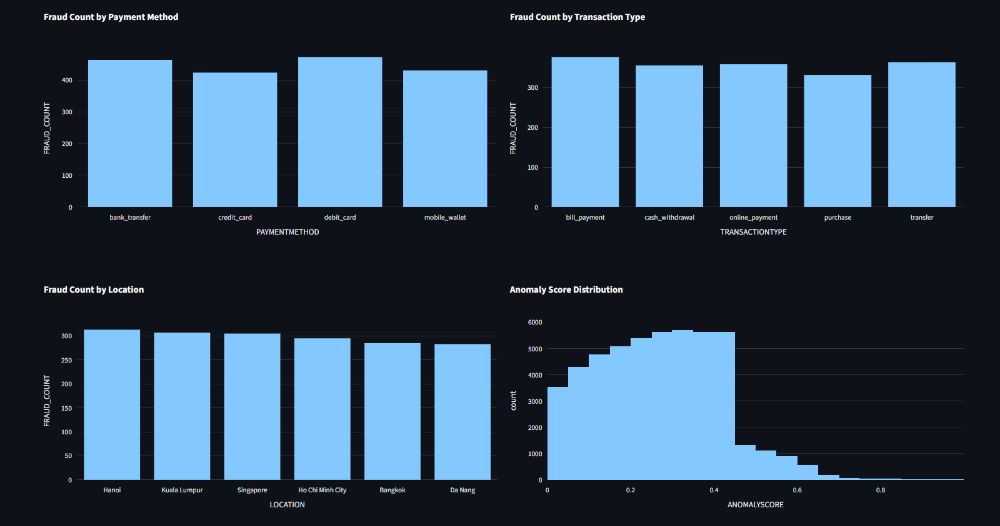

# End-to-End Bank Fraud Detection Analytics Pipeline

## Overview

This project is an end-to-end data engineering pipeline for banking fraud analytics. It processes synthetic banking transaction data from raw storage to analytics-ready models and serves fraud insights through a hosted Streamlit dashboard.

The pipeline uses **AWS S3** as the raw data lake, **Snowflake** as the cloud data warehouse, **dbt** for transformation and data quality testing, **GitHub Actions** for CI/CD, and **Streamlit** for dashboarding.

## Business Problem

Banks need to monitor transaction activity, detect suspicious behavior, identify high-risk users and merchants, and provide fraud investigation teams with reliable analytics.

This project answers key fraud analytics questions:

* What is the overall fraud rate?
* Which transactions require manual review?
* Which users show suspicious behavior?
* Which merchants have elevated fraud risk?
* Which payment methods and transaction types are more exposed to fraud?

## Architecture

```text
Synthetic Banking Transactions
        ↓
AWS S3 Raw Zone
        ↓
Snowflake Staging Table
        ↓
dbt Bronze Layer
        ↓
dbt Silver Layer: Fact & Dimensions
        ↓
dbt Gold Layer: Fraud Analytics Marts
        ↓
GitHub Actions CI/CD
        ↓
Hosted Streamlit Dashboard
```

## Tech Stack

| Layer           | Technology                                  |
| --------------- | ------------------------------------------- |
| Data Generation | Python, Pandas                              |
| Raw Storage     | AWS S3                                      |
| Data Warehouse  | Snowflake                                   |
| Transformation  | dbt                                         |
| Data Modeling   | Bronze/Silver/Gold, Fact & Dimension Tables |
| Data Quality    | dbt Tests                                   |
| CI/CD           | GitHub Actions                              |
| Dashboard       | Streamlit, Plotly                           |
| Version Control | Git, GitHub                                 |

## Data Pipeline

### 1. Data Generation

Synthetic banking transaction data is generated using Python and exported as CSV files partitioned by year.

```text
fraud_detection/raw/year=2022/
fraud_detection/raw/year=2023/
fraud_detection/raw/year=2024/
fraud_detection/raw/year=2025/
fraud_detection/raw/year=2026/
```

### 2. Raw Data Lake

The generated transaction files are uploaded to **AWS S3**, which acts as the raw data lake.

### 3. Snowflake Staging

Raw CSV files are loaded from S3 into the Snowflake staging table:

```text
TRANSACTIONS_STAGING
```

### 4. dbt Transformation

The transformation layer follows a **Bronze/Silver/Gold** architecture.

#### Bronze Layer

Cleans and standardizes raw transaction data.

```text
br_fraud_detection_raw_data_historical
```

#### Silver Layer

Creates core analytical tables.

```text
si_transactions_fact
si_users_dimension
si_devices_dimension
```

#### Gold Layer

Creates dashboard-ready fraud analytics models.

```text
go_fraud_detection_dashboard_metrics
go_user_behavior_metrics
go_merchant_risk_assessment
go_real_time_fraud_detection
go_predictive_model_features
```

## Data Quality

Data quality checks are implemented using dbt tests, including:

* `not_null`
* `unique`
* `accepted_values`

Tested fields include transaction IDs, user IDs, fraud flags, suspicious flags, risk levels, and merchant risk categories.

## Dashboard

The hosted Streamlit dashboard provides:

* Fraud overview KPIs
* Fraud count by payment method
* Fraud count by transaction type
* Anomaly score distribution
* High-risk users
* Merchant risk assessment
* High-risk transaction monitoring

Live Dashboard: `http://192.168.1.61:8501`

## Screenshots

### Architecture



### dbt Lineage



### Streamlit Dashboard




## How to Run

### Install dependencies

```bash
pip install -r dashboard/requirements.txt
```

### Run dbt

```bash
dbt debug --target dev
dbt run --target dev
dbt test --target dev
```

### Generate dbt documentation

```bash
dbt docs generate --target dev
dbt docs serve --target dev
```

### Run Streamlit locally

```bash
python -m streamlit run dashboard/app.py
```

## Key Outcomes

* Built an end-to-end banking fraud analytics pipeline.
* Designed Bronze/Silver/Gold data models using dbt.
* Created transaction fact tables and user/device dimensions.
* Built fraud KPI marts, merchant risk assessment, user behavior metrics, and high-risk transaction monitoring views.
* Implemented automated data quality checks with dbt tests.
* Deployed a hosted Streamlit dashboard for fraud risk monitoring.
* Added CI/CD validation using GitHub Actions.

## Project Status

Completed as a personal data engineering portfolio project focused on banking fraud analytics.
 
